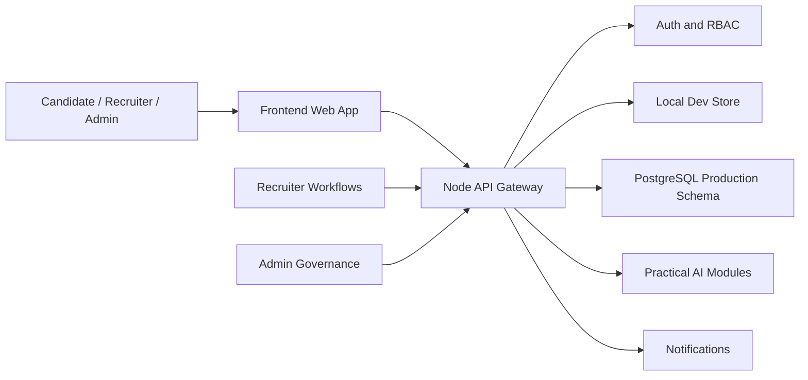

# HerSphere Architecture Guide

## Technology Selection

HerSphere is packaged as a dependency-light JavaScript platform so another developer can run the full product immediately after unzipping it.

- Frontend: Vanilla ES modules with a small client router. This keeps the demo production-runnable without a package install while still using componentized rendering, responsive CSS, accessible markup, dark mode, and API-driven pages. In a funded product, this can be migrated cleanly to React or Next.js because the UI is already split by route and feature.
- Backend: Node.js 22 HTTP API. Node was selected because it provides built-in test runner, fetch, crypto, and web-compatible APIs, which lets this package avoid supply-chain risk while still implementing JWT-style tokens, password hashing, CSRF validation, rate limiting, role checks, and structured routing.
- Database: PostgreSQL 16 schema in `database/migrations`. The local runnable app uses a JSON file store for zero-setup demos, but the production data model is normalized with primary keys, foreign keys, unique constraints, indexes, enums, and update triggers.
- Authentication: Signed JWT-style HMAC tokens, PBKDF2 password hashing, email verification tokens, password reset tokens, role-based authorization, CSRF header validation, and origin checks.
- AI Framework: Deterministic in-repository AI modules. This is deliberate: resume parsing, eligibility, skill gaps, readiness scoring, learning roadmaps, company review summaries, spam detection, and applicant ranking all run without external keys. The API boundary can later swap these modules for LLM or ML services.
- Storage: Local JSON for development and demo portability; PostgreSQL plus object storage for production resumes and portfolio artifacts.
- Deployment: Dockerfiles and `docker-compose.yml` for frontend, backend, and PostgreSQL. Nginx config is included for production static serving and API proxying.
- Testing: Node's built-in test runner covers unit, API integration, and UI smoke tests with no third-party test dependencies.

## System Architecture

## Software Architecture

The backend follows clean architecture boundaries:

- `http`: routing, request parsing, responses, and security headers.
- `security`: password hashing, token signing, validation, rate limiting, CSRF.
- `domain`: errors and serialization rules.
- `infrastructure`: data store, seed data, logging.
- `packages/ai`: pure domain services for career intelligence.

The frontend is organized around route renderers and reusable UI helpers: cards, metrics, progress rows, opportunity cards, forms, and toasts. Every user role has a dedicated dashboard.

## Database Architecture

Production data is normalized across users, profiles, skills, companies, opportunities, applications, interviews, company reviews, notifications, and audit logs. See:

- `database/migrations/001_initial_schema.sql`
- `database/seeds/001_demo_seed.sql`
- `database/er-diagram.mmd`

Important indexes include user role/status, company verification, opportunity search, applications by candidate/opportunity, review moderation, notification unread lookup, and audit log time access.

## API Architecture

The API is resource-oriented:

- `/api/auth/*`: registration, login, email verification, password reset, current user.
- `/api/candidate/*`: profile and candidate workspace.
- `/api/resume/analyze`: resume intelligence.
- `/api/career/dashboard`, `/api/ai/analysis`, `/api/learning-roadmap`: career companion APIs.
- `/api/jobs/*`: search, details, bookmark, apply.
- `/api/companies/*`: company profiles and reviews.
- `/api/recruiter/*`: listings, applicants, candidate ranking, interview scheduling.
- `/api/admin/*`: users, recruiter approval, company verification, review moderation, reports.

Mutating routes require `X-CSRF-Token`. Protected routes require `Authorization: Bearer <token>`.

## AI Architecture

The AI layer is intentionally practical and auditable:

- Resume analysis extracts skills, education, projects, certifications, achievements, and experience.
- Eligibility compares required skills, nice-to-have skills, experience, and profile depth.
- Skill-gap detection returns missing skills, projects, certifications, and experience.
- Learning recommendations convert gaps into courses, projects, certifications, hackathons, internships, and a roadmap.
- Career readiness produces resume, technical, interview, and overall scores.
- Smart recommendations rank jobs and internships against candidate profiles.
- Company review intelligence summarizes culture, safety, mentorship, growth, balance, trust score, and spam signals.

This avoids pretending to have external AI access while still delivering explainable career intelligence.
